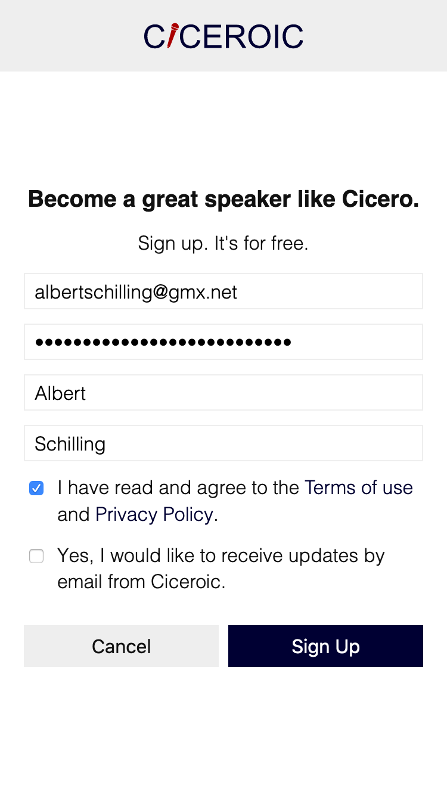
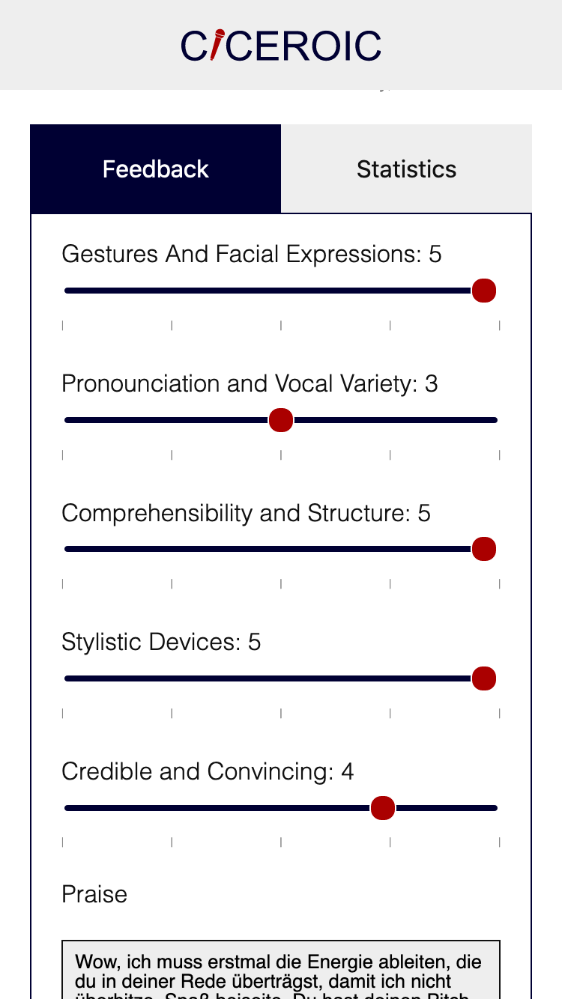
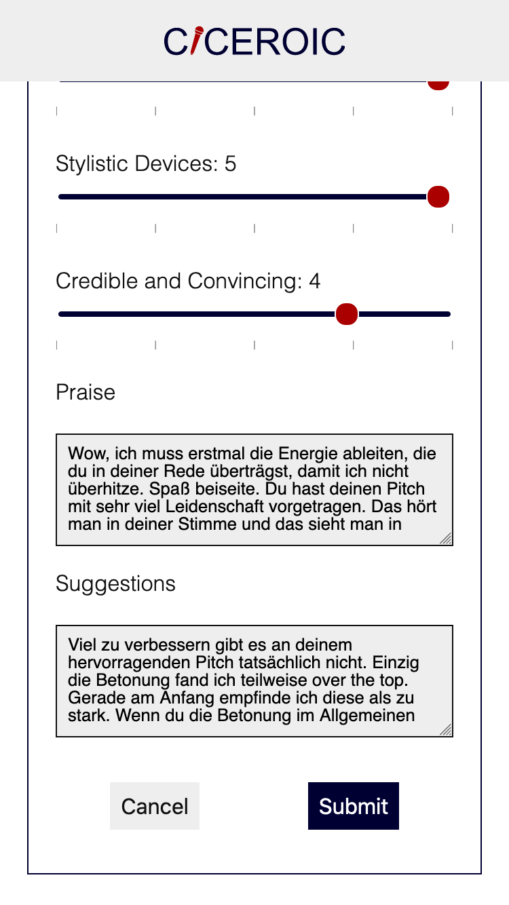
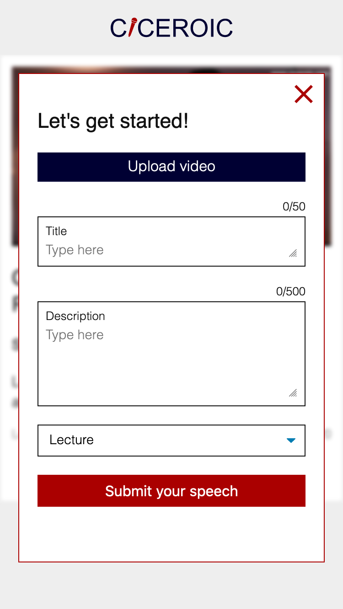
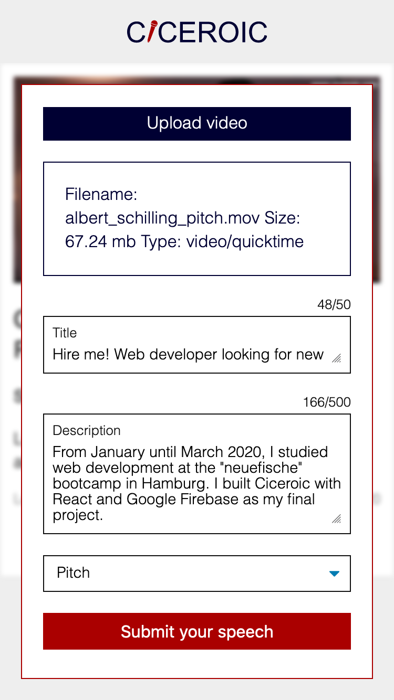
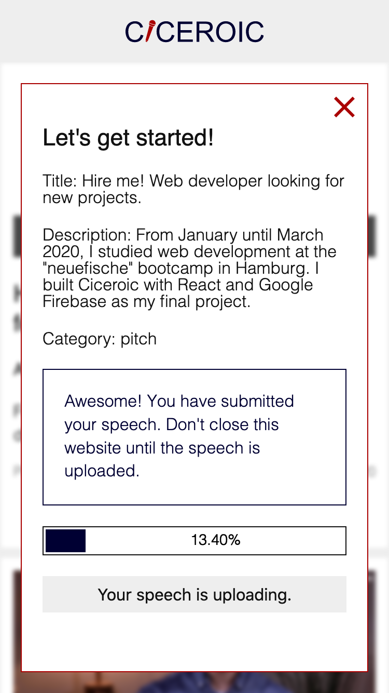
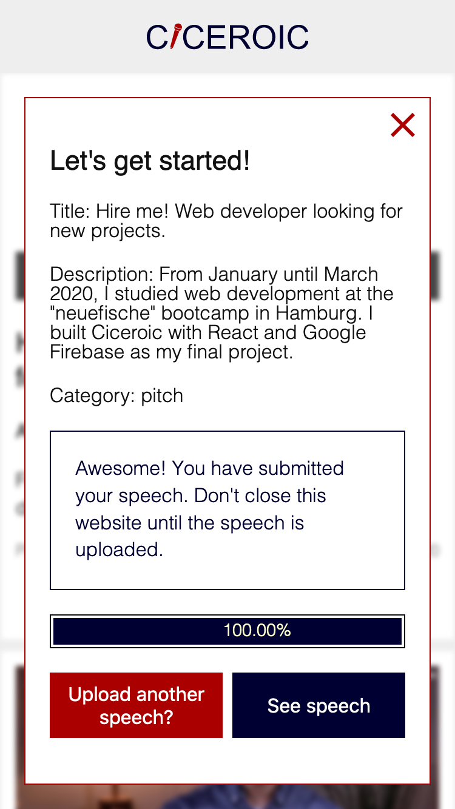
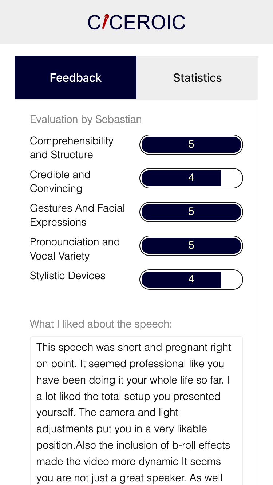
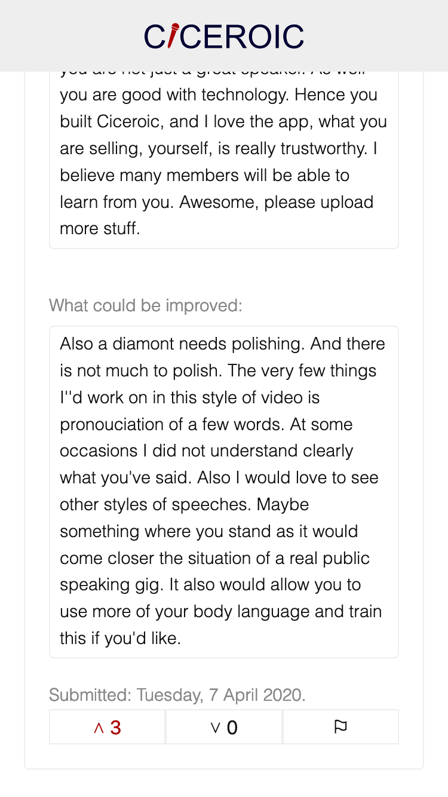
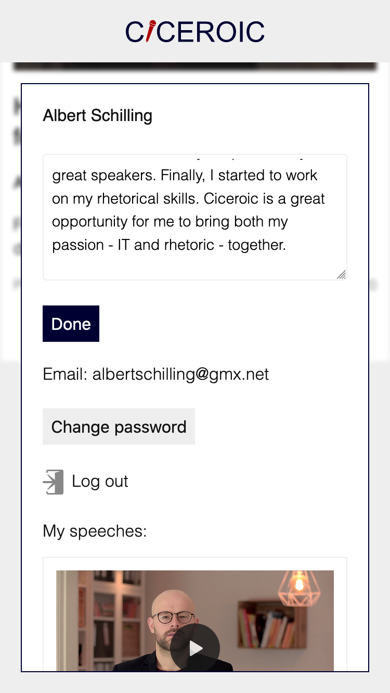

# Ciceroic

## Become a Heroic Speaker like Cicero

This app offers a platform to upload speeches and to give and receive feedback in order to improve your rhetorical skills and become a great speaker.

URL: [ciceroic.web.app](https://ciceroic.web.app/)

## Tech stack

- React
- Google Firebase
- Jest
- Cypress
- Storybook
- Styled-Components
- React Router

Found any bugs and security issues or would like to contribute with your own suggestions or code? Please, contact me: [albertschilling@gmx.net](mailto:albertschilling@gmx.net)

## Features

### Access

Speaking in front of an audience feels for many people as a particularly vulnerable moment. Ciceoric offers a closed platform where you can improve your rhetorical skills in a protected environment. Thus, you have to sign in to use the app.

|                       Sign in                        |                       Sign up                        |
| :--------------------------------------------------: | :--------------------------------------------------: |
|  |  |

### Watch Speeches

On the homepage you can watch speeches uploaded by other users, evaluate these and learn from them.

### Evaluate Speeches

Evaluate the speeches of others according to specified dimensions and share your praise and suggestions.

|                Evaluate specific dimensions                 |                        Share your Praise                         |                Share your Suggestions                 |
| :---------------------------------------------------------: | :--------------------------------------------------------------: | :---------------------------------------------------: |
|  |  |  |

### Upload Speech

|                    Upload your speech                     |             Add title, description and category             |
| :-------------------------------------------------------: | :---------------------------------------------------------: |
|  |  |

|  Continue using the app while the video is uploading   |         Check out your speech after uploading         |
| :----------------------------------------------------: | :---------------------------------------------------: |
|  |  |

|                 Check out the evaluations you received                 |     Up-/downvote or flag an evaluation as inappropriate      |
| :--------------------------------------------------------------------: | :----------------------------------------------------------: |
|  |  |

### Edit your Profile

|                 Profile and settings                  |                      Upload a portrait                       |                     Edit your biography                     |
| :---------------------------------------------------: | :----------------------------------------------------------: | :---------------------------------------------------------: |
|  |  |  |

### See other user's profile

## Further Technical Information

This project was bootstrapped with [Create React App](https://github.com/facebook/create-react-app).

You need to install Firebase CLI 'npm install -g firebase-tools' and intialize it to use and deploy your firebase project.

For more information check out the [firebase CLI documentation](https://firebase.google.com/docs/cli/).
